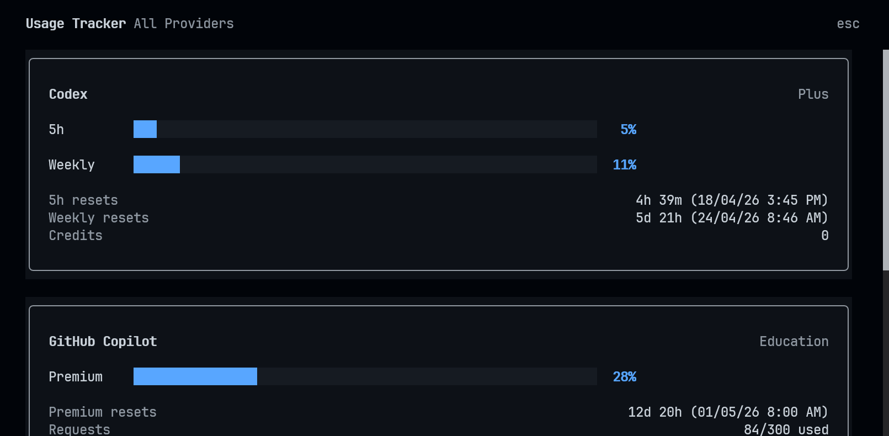

# OpenCode **Usage Tracker**

Track provider usage inside OpenCode with a native TUI dialog through a simple `/usage` command.

## Supported Providers

- Codex
- GitHub Copilot
- MiniMax (new, untested)
- Kimi (new, untested)
- Z.AI (new, untested)

## Install

Recommended:

```bash
opencode plugin -g opencode-usage-tracker
```

Manual install:

For a global manual install, add `opencode-usage-tracker` to both `~/.config/opencode/opencode.json` and `~/.config/opencode/tui.json`.

`~/.config/opencode/opencode.json`

```json
{
  "$schema": "https://opencode.ai/config.json",
  "plugin": ["opencode-usage-tracker"]
}
```

`~/.config/opencode/tui.json`

```json
{
  "$schema": "https://opencode.ai/tui.json",
  "plugin": ["opencode-usage-tracker"]
}
```

## Try It

Configure a supported provider in OpenCode, then open the tracker with either:

- `/usage`
- Command palette -> `Usage`

If you have multiple supported providers configured, the plugin shows a picker first.

## Notes

- Read-only: the plugin only fetches usage data
- No cache: usage is fetched fresh each time
- More provider support is coming. If you want to help add one, see [`docs/PROVIDERS.md`](./docs/PROVIDERS.md).

## License

MIT
